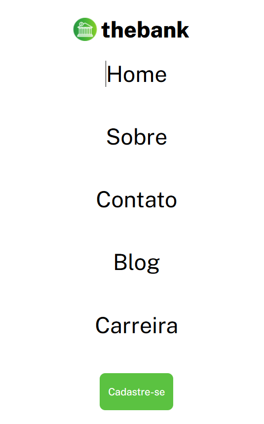

# Menu_Com_Flexbox

The purpose of this project is to create a responsive menu with flexbox.

[Page Link](https://carlab09.github.io/menu_com_flex_box/)

#### Results:
*  View the optimal layout for the page depending on their device's screen size
*  See hover states for all interactive elements on the page

#### Technologies used:
*  HTML
*  CSS

## Conclusion

I am very pleased to have completed this project.

#### Design_Desktop:

#### Design_Mobile:

